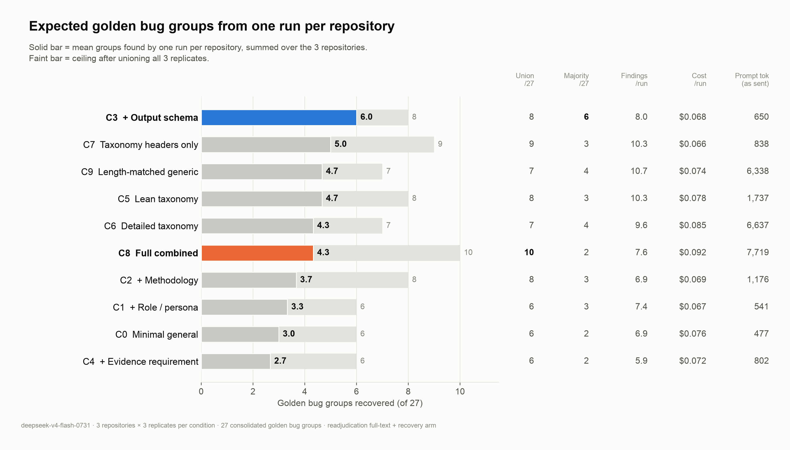
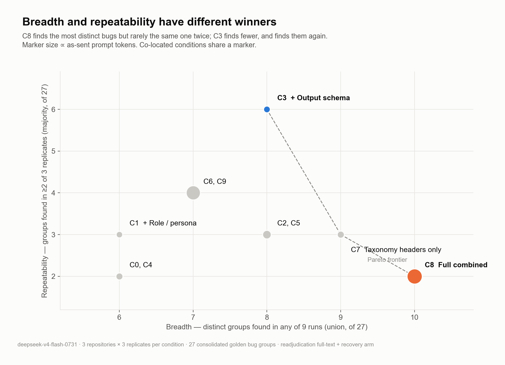
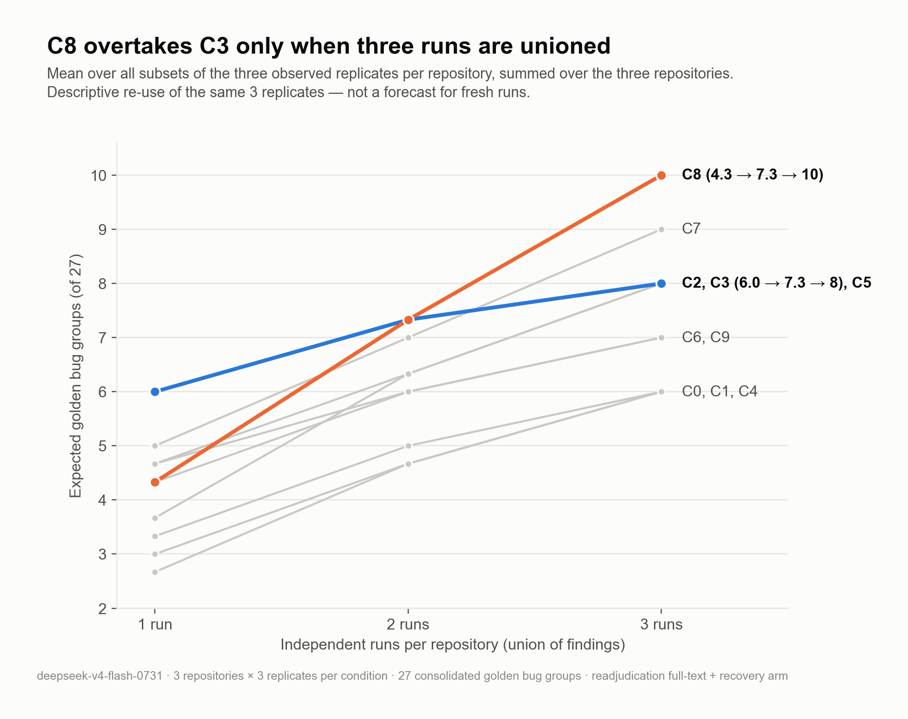
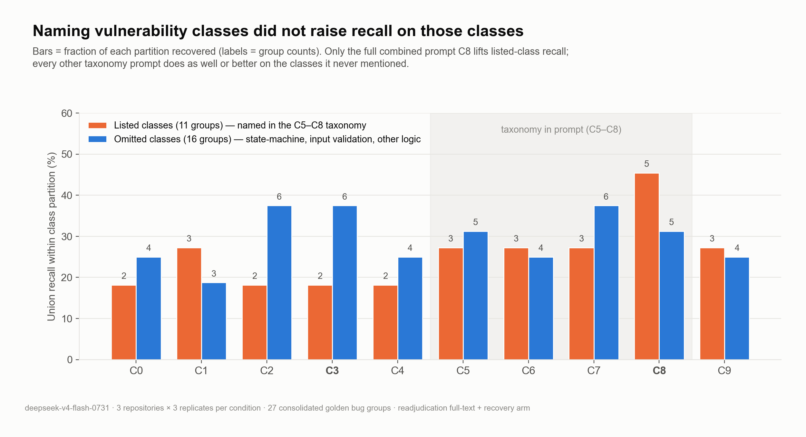
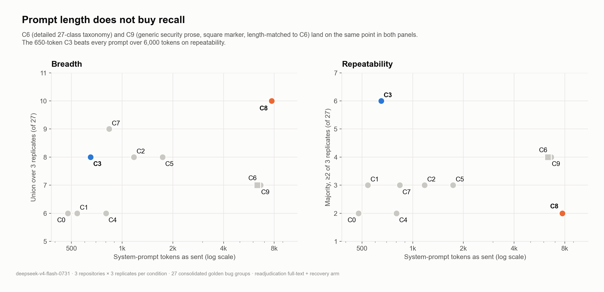
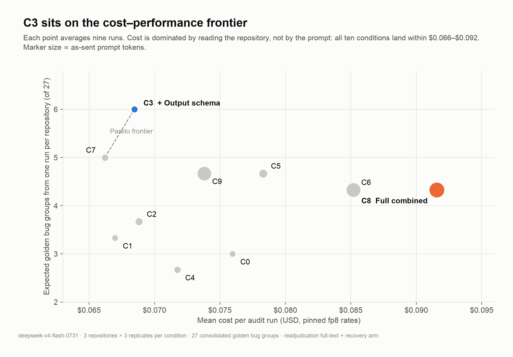

# What a system prompt actually changes in an LLM code audit

*web3evals.com · August 2026*

Most LLM auditing tools ship with a long system prompt: a senior-auditor persona, a review methodology, a taxonomy of vulnerability classes with examples, and an evidence standard. These prompts grow the way audit checklists grow. Every missed bug adds a paragraph, and nothing is ever removed. We wanted to know which of those paragraphs change what the model finds.

To measure it, we ran one model, DeepSeek V4 Flash, against three real Code4rena codebases with 33 known high-severity findings, under ten system prompts ranging from 477 to 7,719 tokens, with three replicates per repository. Every candidate finding was matched to the ground truth blind, by three independent judges, on root cause. Ninety audits in total.

Four observations came out of it:

- **Reading was prompt-invariant; judgment was not.** Every one of the ten prompts read the same files in the same order and covered 100% of the golden bug sites. Recall still ranged from 6 to 10 of 27 bug groups. What the prompt changed was which candidates the model raised, kept, and wrote up.
- **A 650-token reporting schema produced the highest single-run yield and the highest repeatability.** Condition C3 averaged 2.0 correct bug groups per run, reproduced 6 of 27 groups across replicates (no other prompt above 4), and four of its six repeatable finds were protocol-logic bugs outside any standard vulnerability class.
- **Naming a vulnerability class did not raise recall on that class.** The lean, detailed and headers-only taxonomies all scored 3 of 11 on the classes they named, identical to a prompt with no taxonomy. The taxonomy showed up as grep queries for code tokens such as `nonReentrant` and `delegatecall`, not in which files were opened or in what order.
- **The largest prompt found the most distinct bugs and repeated as few as the baseline.** The 7.7k-token combined prompt (C8) reached 10 of 27 groups across nine runs, but only 2 of 27 in at least two replicates, the same as C0, and eight of its ten groups were found once. Breadth and repeatability turned out to be different properties with different winners; with one run per repository, C8 expected 4.3 groups against C3's 6.0.



## Overview

### 1. Breadth and repeatability are different properties

We scored every prompt two ways. **Union** counts a bug group as found if any of the three replicates on its repository reported it. **Majority** counts it only if at least two of three did. Union is what a team gets by running a prompt three times and merging the reports; majority is what a single run can be expected to deliver.



The two metrics disagree about the leader. C8, the combined prompt, has the widest union at 10 of 27 and sits at the floor on majority at 2 of 27, tied with the bare baseline C0 and the evidence-gated C4. Eight of its ten groups were found in exactly one replicate. C3, the reporting-schema prompt, is at 8 union and 6 majority, and four of those six groups were found in all three replicates. No other prompt reached 3 of 3 on more than three groups.

Before scoring, we pre-registered a ranking rule: a prompt outranks another only if it leads on both union and majority. Under that rule 17 of the 45 pairwise comparisons resolve and 14 are contradictory, with the two metrics pointing in opposite directions rather than differing in margin. Six of the 14 contradictions involve C8. What does resolve is narrow: C3 ranks above C0, C1, C4, C6 and C9 on both metrics, the only prompt with a consensus advantage over a majority of the grid, and C0 and C4 rank jointly last. C3 against C8 does not resolve.



The crossover is visible as a function of how many runs are merged. With one run per repository, C3 expects 6.0 groups and C8 expects 4.3. With two runs merged they tie at 7.3. Only after all three replicates are unioned does C8 lead, 10 to 8. These curves re-use the same three observed replicates rather than forecasting fresh ones, but the shape is consistent: C8's breadth is an ensemble property, and C3's yield is a single-run property.

### 2. Naming a vulnerability class did not raise recall on it

The taxonomy used in C5 through C8 lists 27 vulnerability classes. It deliberately leaves out three: state-machine transitions, missing input validation, and protocol-specific logic. Of the 27 golden bug groups, 11 fall in a class the taxonomy names and 16 fall in one it omits. That split lets us ask directly whether telling the model about a class helps it find instances of that class.



It did not, with one exception. On the 11 listed groups, the lean taxonomy (C5), the detailed taxonomy (C6), the headers-only taxonomy (C7) and the length-matched control with no taxonomy at all (C9) all scored exactly 3. So did C1, which adds only a persona. Only C8 lifted listed-class recall, to 5 of 11, and each of those five was found in one replicate out of three. On the 16 omitted groups, every taxonomy prompt did as well or better than on the classes it named.

Where the prompts separate is in the omitted classes, and this is where the practical observation lies. C3 tied for the best omitted-class recall at 6 of 16 (with C2 and C7) and was the only one of the three to reproduce most of those finds. Four of C3's six repeatable groups are omitted-class bugs: Noya's multi-token oracle price error, the `_getPositionTVL` accounting family, a Dolomite holding-position bug, and BendDAO's yield-bot unstake failure. The two listed-class groups it repeated, a `Registry` remove-position bug and BendDAO's liquidation underflow, were found by 5 and 10 of the ten prompts respectively.

C8's additional breadth over C3 sits entirely in the listed classes: 5 listed groups to C3's 2, and 5 omitted to C3's 6. The extra bugs the combined prompt surfaces are the ones in classes a checklist already names, and it surfaces each of them once.

The benchmark itself describes what high-severity bugs look like in these contests. Sixteen of the 27 groups, 22 of the 33 individual reports, are in the classes the taxonomy omits. That distribution is consistent with a codebase reaching a public contest after static analysis and standard review have already removed most pattern-matchable issues; what remains as High is mostly logic that is specific to the protocol. We did not measure that pipeline, but it is the environment these numbers come from. In it, the prompt that most reliably produced findings was the one that said nothing about vulnerability classes and instead constrained how a finding must be reported.

### 3. Prompt length bought nothing



C6 is the detailed taxonomy: 27 classes, each with a mechanism, five red flags and a historical incident, 6,637 tokens as sent. C9 is a length control: 6,338 tokens of generic secure-development prose with no vulnerability class named. The two are indistinguishable on every count we recorded: 7 union, 4 majority, 3 listed, 4 omitted. They overlap on only 3 of their 7 groups, so they found different bugs, at the same rate. C7, which reduces the taxonomy to its 27 class headers in 838 tokens, scored 9 union, above both.



Cost did not separate the prompts either. All ten conditions landed between $0.066 and $0.092 per run at pinned fp8 rates, and the ordering follows turns and tool calls rather than prompt size: C8 averaged 20.3 turns and 44.8 tool calls, C7 17.3 and 39.2. C3 and C7 sit on the observed frontier. Candidate volume varied more than cost: C4 emitted 53 findings across nine runs, C9 emitted 96. C3's 72 candidates contained more matches to the golden set than C9's 96.

## Methodology

### Model and harness

All 90 runs use `deepseek-v4-flash-0731` (fp8, reasoning effort high) through OpenRouter with the provider pinned and fallbacks disabled, so every run hits the same endpoint. We chose a fast, inexpensive model deliberately: the question was about the prompt, and the grid needed to be large enough to replicate.

The agent has four read-only tools: list files, read a file (optionally a line range), grep, and a contract-structure summary. There is no compiler, fuzzer or test runner. Each run is capped at 38 turns. The model reads the repository and writes findings.

### Codebases and ground truth

The three repositories are Code4rena contests with published high-severity results: reNFT (January 2024), Noya (April 2024) and BendDAO (July 2024). Together they carry 33 high-severity reports. Several reports share a root cause and a fix (Noya's `_getPositionTVL` family is seven reports with one fix), so the 33 reports were consolidated into 27 root-cause groups: reNFT 6, Noya 14, BendDAO 7. All counts in this post are groups out of 27 unless stated otherwise.

Each group is labelled listed or omitted according to whether its vulnerability class appears in the C5–C8 taxonomy. Eleven groups are listed; sixteen are omitted (state-machine, input validation, protocol-specific logic).

### Conditions

Ten prompts. Every prompt shares the same task framing and the same output block (the finding template and the severity rubric), so the ablation is confined to what sits between them. C0 through C4 each add one component. C5 through C8 form the taxonomy ladder. C9 is a length control for C6. Token counts are "as sent": the prompt file as delivered to the model, counted with the model's own tokenizer.

| Condition | Treatment | What it adds | Taxonomy | Prompt tokens (as sent) |
|---|---|---|---|---|
| C0 | Minimal general | Task framing + shared output contract only | None | 477 |
| C1 | + Role / persona | C0 + 46-word senior-auditor persona | None | 541 |
| C2 | + Methodology | C0 + 7-step review procedure (map, state, arithmetic, symmetry, safety justification) | None | 1,176 |
| C3 | + Output schema | C0 + reporting requirements: actionable, precisely located, one root cause per finding, justified severity | None | 650 |
| C4 | + Evidence requirement | C0 + precondition, call trace, missing check, priced impact, self-refutation; do not report without a trace | None | 802 |
| C5 | Lean taxonomy | C0 + 27 vulnerability classes with one-line mechanism + examples | Lean | 1,737 |
| C6 | Detailed taxonomy | C0 + 27 classes, each with mechanism, 5 red flags, historical example | Detailed | 6,637 |
| C7 | Taxonomy headers only | C0 + 27 class headings (with short parentheticals) | Headers | 838 |
| C8 | Full combined | Role + task + methodology + detailed taxonomy + evidence requirement | Detailed | 7,719 |
| C9 | Length-matched generic | C0 + ~6k tokens of secure-development prose, no vulnerability classes (length control for C6) | None | 6,338 |

The C3 addition, in full, is the following block placed between the task framing and the shared output template:

```
## Reporting requirements

Every finding must be independently actionable by a developer who has not read
this analysis. That means every finding must carry a precise file path, function
name, and line range; a severity assigned strictly according to the rubric below;
and an impact statement that names who loses what.

Do not report an issue without a location. Do not group multiple distinct root
causes into one finding. Do not assign a severity you cannot justify from the
rubric.
```

### Runs and endpoints

Ten conditions, three repositories, three replicates: 90 runs. For each condition we report union (groups found in any replicate on their repository), majority (groups found in at least two of three), and the expected number of groups from a single run (the mean over replicates, summed across the three repositories).

### Matching

A candidate finding is credited against a golden bug only on root cause. For each of the 33 bugs we reconstructed a written root cause and an exclusion boundary from the source, with each draft adversarially reviewed by two independent agents reading the same code. Every candidate–golden pair was then judged by three independent LLM judges, blind to condition, with a majority verdict and recorded tiebreaks. Findings that matched no pair by location were swept a second time for root-cause matches ignoring file anchoring, so a correct finding reported at a caller rather than the callee still counts. Only exact root-cause matches are credited; title or line-range proximity is not.

## Results

| Condition | Union /27 | Majority /27 | Found 3/3 | Listed /11 | Omitted /16 | Groups/run | Findings /run | Cost /run | Turns | Tool calls | Grep calls |
|---|---|---|---|---|---|---|---|---|---|---|---|
| C0 | 6 | 2 | 1 | 2 | 4 | 1.00 | 6.9 | $0.076 | 18.4 | 41.8 | 1.7 |
| C1 | 6 | 3 | 1 | 3 | 3 | 1.11 | 7.4 | $0.067 | 18.7 | 40.6 | 3.1 |
| C2 | 8 | 3 | 0 | 2 | 6 | 1.22 | 6.9 | $0.069 | 18.4 | 40.1 | 2.8 |
| C3 | 8 | 6 | 4 | 2 | 6 | 2.00 | 8.0 | $0.068 | 18.7 | 41.0 | 2.4 |
| C4 | 6 | 2 | 0 | 2 | 4 | 0.89 | 5.9 | $0.072 | 18.7 | 41.7 | 2.4 |
| C5 | 8 | 3 | 3 | 3 | 5 | 1.56 | 10.3 | $0.078 | 18.2 | 42.0 | 3.8 |
| C6 | 7 | 4 | 2 | 3 | 4 | 1.44 | 9.6 | $0.085 | 20.2 | 43.1 | 5.4 |
| C7 | 9 | 3 | 3 | 3 | 6 | 1.67 | 10.3 | $0.066 | 17.3 | 39.2 | 1.8 |
| C8 | 10 | 2 | 1 | 5 | 5 | 1.44 | 7.6 | $0.092 | 20.3 | 44.8 | 4.9 |
| C9 | 7 | 4 | 3 | 3 | 4 | 1.56 | 10.7 | $0.074 | 19.4 | 40.3 | 2.6 |

A few rows deserve comment beyond the three overview sections.

**C4, the evidence requirement, ranked jointly last with the baseline.** It produced the fewest candidate findings (53 across nine runs), the longest answers (3,799 answer tokens per run, 23% above C0), and 6 union, 2 majority, with no group found in all three replicates. The requirement to supply a concrete trace before reporting, and to attempt a refutation first, removed candidates in both directions; the qualitative section below has the specific cases.

**C1, the persona, behaved as a cheap perturbation rather than as expertise.** It matched C0's union at 6 but only 2 of its 6 groups overlap with C0's; combined, the two prompts cover 10 of 27. It was 12% cheaper than C0 and reached its first finding sooner, with no visible change in the reasoning the persona describes.

**C2, the methodology, raised breadth without raising repeatability.** It moved from C0's 6 to 8 union with the same 62 candidate findings, and 6 of its 8 groups were omitted-class. Its majority stayed at 3, and it was the only condition besides C4 with no group at 3 of 3.

**C5 and C7 emitted exactly 93 findings each and overlapped on 6 groups.** C6 and C9 emitted 86 and 96 and matched on every aggregate. Across the grid, more candidate findings did not translate into more repeatable ones: the two conditions with the highest majority, C3 and C6/C9, are in the middle of the volume range.

## Qualitative analysis

We read the reasoning traces for all 90 runs and coded them against a fixed set of behaviour cards. Most of the observations below are counts of runs out of nine per condition.

### Coverage was saturated in every condition; discovery was not

Strict function coverage and golden-bug-site coverage were 1.00 for all ten conditions. Every prompt read every function that contained a golden bug. Recall still ranged from 6 to 10 groups. Reading the vulnerable code was never the constraint; recognising the vulnerable behaviour was.

### The same files, the same order, different bugs

All 90 runs opened with an unscoped file listing, and all 90 built a repository inventory before forming any hypothesis. Across replicates within a condition, the set of files touched diverged by 0.00 in every condition, and reading ranges diverged by 0.04 to 0.13. The findings diverged by 0.75 to 0.89. Three runs of the same prompt on the same repository read the same code along the same path and reported substantially different bugs. The variance is in hypothesis selection, not in access.

This is also the observation that bears on how much a prompt can shape the model's method. None of the ten prompts changed the opening move, the sweep, or which functions were cleared. The seven-step methodology in C2 and C8 produced a visible inventory step in five of nine C8 runs, but the inventory was an opening ritual rather than an artifact the run kept consulting. The twelve sections of secure-development guidance in C9 did not organise a single run. What the prompts did move was downstream: which candidates the model raised, kept, and wrote up.

### The taxonomy reached the grep bar, not the file selection

Of the 183 vocabulary entries in the taxonomy, 156 never appeared in any of the 278 grep queries across all 90 runs. The 27 that did are code tokens: `nonReentrant`, `balanceOf`, `delegatecall`, `transferFrom`, `liquidation`. No complete class title appeared in any grep. Taxonomy prompts did grep more and grep differently, with taxonomy-side terms making up 36% of C6's queries against 0% for C0 and 2% for C3, and C6 averaging 5.4 grep calls per run against C0's 1.7. But no taxonomy run selected its first file by class, and in every taxonomy condition the class names surfaced mainly at synthesis and write-up. In the trace coding, "the list arrives as a label, never as a lead" held in nine of nine C5 runs, and "a heading is a write-up vocabulary, not a search vocabulary" held in nine of nine C7 runs.

### The reporting schema changed what got reported, not what got read

C3's searches were the most protocol-anchored in the grid, with 56% of its grep queries built from identifiers specific to the repository under audit, but its reading procedure was otherwise indistinguishable from C0's. Its distinctive behaviour appeared late. In five of nine runs the reporting contract visibly arbitrated the output: a candidate was split into its own block because two root causes could not be grouped, a hedged observation was written up because a precise, actionable report could be constructed for it, and line ranges were sometimes fetched after the substantive decision had been made. C3 raised more hypotheses per run than the methodology prompt (88.6 against C2's 63.1) and abandoned more of them (28.0 against 17.9). It adopted a "single planted bug" frame in three of nine runs, against eight of nine for C2.

The same mechanism cut the other way once. C3's only Critical-severity candidate, a claimed missing peer check on a LayerZero receiver, is contradicted by the pinned dependency: `OAppReceiver` v2.2.4 performs the check the finding said was absent. A schema that rewards a well-formed report can override calibrated uncertainty.

### Concrete instructions were followed; abstract ones were not

C2's fourth step, substituting concrete values into every arithmetic expression, changed the status of a candidate in seven of nine runs and eliminated two fabricated reports, one of them a would-be Critical. C2's seventh step, naming the specific check that justifies clearing an area before moving on, left no trace in any of the nine runs. C8 asked for an explicit "investigated and ruled out" section; three of nine runs produced one, and even those omitted some of the dismissed golden bugs. Across the grid, "concrete values as the discovery act" was coded in nine of nine runs for C5, C6 and C9, and in five of nine for C0, which had no instruction about it.

### The evidence gate removed fabrications and real bugs alike

C4's evidence standard, and the same requirement inside C8, filtered in both directions. It removed a fabricated LayerZero Critical. It also removed BendDAO H-02: all three C8 runs on BendDAO noticed that `isolateRepay()` never checks `onBehalf == nftOwner`, and all three dismissed it as harmless "charitable repayment" before the impact was traced. A C4 run identified a genuine TVL accounting error with concrete numbers and discarded it as insufficiently verifiable. Every run in C6, C8 and C9 examined and cleared at least one true bug. The burden was asymmetric: a full concrete trace to report, and one plausible blocking check to dismiss.

### Recalled upstream source stood in for reading it

In five to eight runs out of nine, depending on condition, the model reasoned about a dependency from memory (OpenZeppelin, LayerZero OApp, Chainlink consumers) rather than opening the pinned version in the repository. The same non-golden findings recurred across conditions and replicates as a result: LayerZero peer verification, Chainlink staleness and L2 sequencer checks, EIP-712 omissions, fee-on-transfer handling in escrow. These appeared under the taxonomy prompts and equally under C9, which names no class. Removing the taxonomy from the prompt did not remove the model's own.

### Different prompts found different bugs

C0 and C7 together cover 13 of 27 groups and share only 2. C6 and C9 have identical aggregates and share 3 of their 7 groups. C5 and C7 both emitted 93 candidates and overlap on 6 groups. No prompt found more than 10 groups alone; 16 of 27 were found by at least one, and 11 by none. The union across prompts is considerably larger than the union across replicates of any single prompt.

## Limitations and future work

This is version zero of the study: 90 audits, one flash-tier model, three repositories, three replicates per cell, read-only tooling, and one taxonomy constructed around this benchmark. Three replicates mean every support value is 0, 1, 2 or 3 of 3, and a single run flips any group between "one-off" and "repeatable". Recall is the only endpoint; the several hundred candidate findings that matched no golden bug were not adjudicated, and some of the recurring ones correspond to official Medium-severity issues. The three repositories differ in size and ground-truth density, with Noya contributing 14 of the 27 groups, and no condition reproduced a reNFT bug in two of three replicates. Only 8 of the taxonomy's 27 listed classes have a golden instance, so listed-versus-omitted comparisons rest on unequal populations. Most reasoning traces are incomplete, which is why the qualitative section reports counts of observed behaviour and not causes.

The next version broadens the spectrum along each of these axes. Several frontier models rather than one, to test whether the reading-invariance and the schema effect hold across model families or are a property of this one. A larger and decontaminated repository set, drawn from contests after the models' training cutoffs, so that recalled upstream source and recalled contest findings cannot substitute for reading. Precision adjudication of every candidate finding, so that candidate volume can be priced. PoC execution in the loop, so that "the evidence gate" is a test run rather than a self-refutation. A factorial ablation of C8's components, since the combined prompt's breadth cannot currently be attributed to any one of them. And more replicates per cell, so that repeatability is measured on a finer scale than thirds.

---

*Figures and tables are regenerated from the study's `data.json`; light and dark variants are in the repository. Model: deepseek-v4-flash-0731. Three repositories × three replicates × ten conditions. Twenty-seven consolidated golden bug groups from 33 Code4rena high-severity reports. Primary endpoint: blind three-judge root-cause matching on full finding text plus location-agnostic recovery.*

Please cite this work as:

```
@misc{web3evals2026systemprompt,
  title  = {What a system prompt actually changes in an LLM code audit},
  author = {web3evals},
  year   = {2026},
  url    = {https://www.web3evals.com/},
}
```
