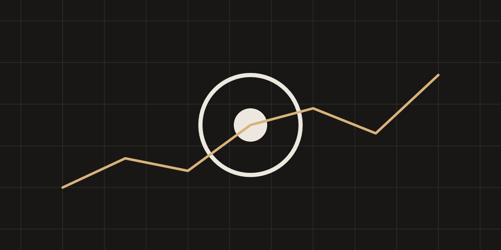

This post exists so the rendering pipeline can be checked end to end. It is
`draft: true` and never ships to production, but it is rendered in deploy
previews and `npm run dev`. If something here looks wrong, the pipeline has
regressed.

## Text and inline elements

Body copy is Inter at roughly 17.5px with a 1.65 line height. **Bold text**
uses the Inter 600 face, *italic text* uses the Inter 400 italic face, and
`inline code` uses JetBrains Mono. Smart quotes -- "like these" -- and
dashes---like this one---come from the typographer option. An external link
looks like [the Solidity docs](https://docs.soliditylang.org/), an internal
one like [the home page](/), and a bare URL like https://www.web3evals.com/ is
auto-linked.

### A third-level heading

Here is a paragraph with a footnote reference.[^1] And a second one, to make
sure numbering and backlinks behave.[^second]

#### A fourth-level heading (Inter 600)

Text under an `h4` for completeness.

## Blockquote

> The purpose of an evaluation is not to produce a number. It is to produce a
> number whose failure modes you understand.

## Lists

1. Ordered item one
2. Ordered item two
   1. Nested ordered item
3. Ordered item three

- Unordered item
- Another unordered item
  - Nested unordered item
- A final item with `inline code`

## Code

Solidity:

```solidity
// SPDX-License-Identifier: MIT
pragma solidity ^0.8.24;

contract Vault {
    mapping(address => uint256) public balances;
    uint256 public constant MAX_DEPOSIT = 100 ether;

    event Deposit(address indexed from, uint256 amount);

    function deposit() external payable {
        require(msg.value <= MAX_DEPOSIT, "too much");
        balances[msg.sender] += msg.value;
        emit Deposit(msg.sender, msg.value);
    }

    function withdraw(uint256 amount) external {
        uint256 bal = balances[msg.sender];
        require(bal >= amount, "insufficient");
        balances[msg.sender] = bal - amount;
        (bool ok, ) = msg.sender.call{value: amount}("");
        require(ok, "transfer failed");
    }
}
```

Rust:

```rust
use std::collections::HashMap;

#[derive(Debug, Default)]
pub struct Ledger {
    balances: HashMap<String, u64>,
}

impl Ledger {
    /// Credit an account, saturating at u64::MAX.
    pub fn credit(&mut self, who: &str, amount: u64) -> u64 {
        let entry = self.balances.entry(who.to_string()).or_insert(0);
        *entry = entry.saturating_add(amount);
        *entry
    }
}
```

bash:

```bash
#!/usr/bin/env bash
set -euo pipefail

forge test --match-test test_withdraw -vvv
export RPC_URL="https://eth.llamarpc.com"
echo "done: $(date +%F)"
```

A diff and some JSON:

```diff
- require(bal > amount, "insufficient");
+ require(bal >= amount, "insufficient");
```

```json
{ "model": "claude-fable-5", "tasks": 128, "pass_rate": 0.42 }
```

A fence with no language:

```
plain preformatted text
   with indentation preserved
```

## Image



## Table

| Model | Tasks | Pass@1 | Pass@5 | Median cost / task | Notes |
|---|---:|---:|---:|---:|---|
| Model A | 128 | 42.1% | 61.7% | $0.83 | Baseline configuration, no tools |
| Model B | 128 | 38.9% | 58.2% | $0.41 | Same prompt, cheaper tier |
| Model C (agentic) | 128 | 55.4% | 70.3% | $4.12 | Tool use enabled, 20-step budget |
| Model D (agentic) | 128 | 51.0% | 66.9% | $6.75 | Tool use enabled, 50-step budget |

## Math

Inline math like $E = mc^2$ and $\frac{a}{b} + \sqrt{x^2 + y^2}$ sits in the
line of text. Display math gets its own block:

$$
\text{Pass@}k = \mathbb{E}_{\text{tasks}}\left[ 1 - \frac{\binom{n - c}{k}}{\binom{n}{k}} \right]
$$

And another:

$$
\sum_{i=1}^{n} w_i \, \ell(\hat{y}_i, y_i) \quad \text{subject to} \quad \sum_i w_i = 1
$$

## Horizontal rule

---

That is everything.

[^1]: This is the first footnote. It can contain `code` and *emphasis*.
[^second]: The second footnote, with a [link](https://www.web3evals.com/).
